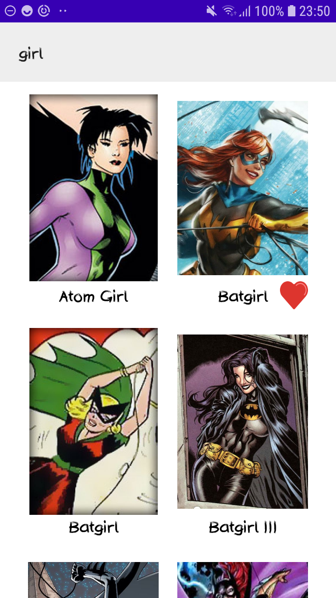
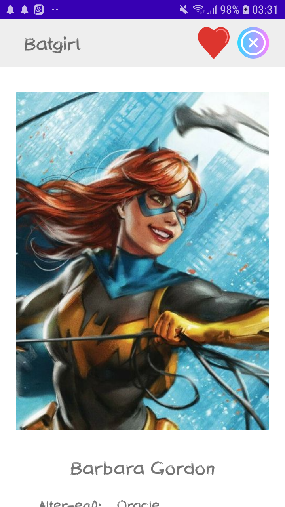
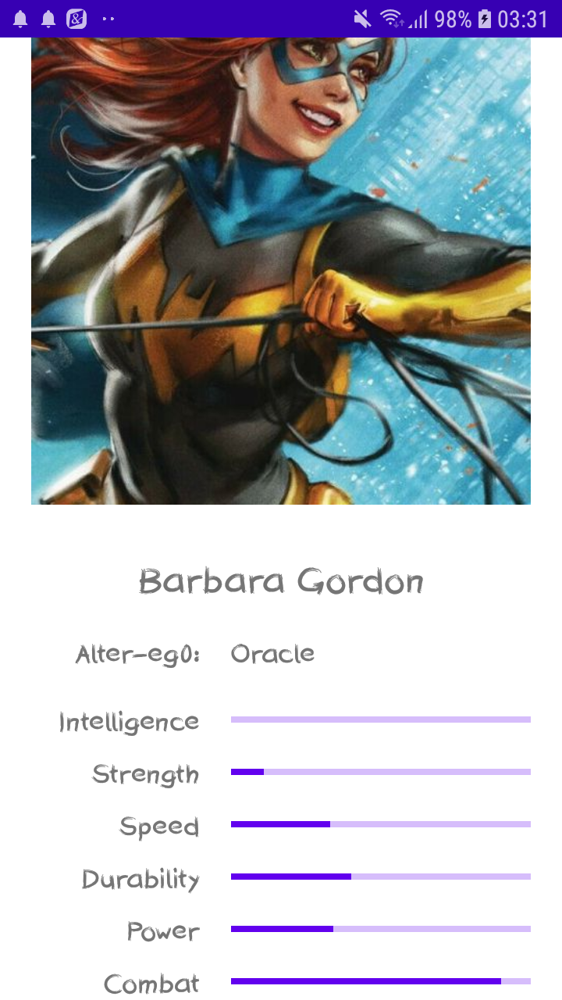

# superhero
Example application build on www.superheroapi.com API as an architecture test case.

The purpose of this application is to show usage of some basic libraries and architecture concepts:
* Clean architecture
* MVVM
* Data binding
* rxKotlin
* LiveData (Just as an example, for consistency real project should use RxLiveData or https://github.com/JakeWharton/RxBinding)
* Lottie
* Glide
* FastAdapter

## Screen shots

Further development should be focused on:
* androidTests
* Support for animations and transitions
* More consistent form of FlowInstance
* Prepare few branch-es with different set of components

